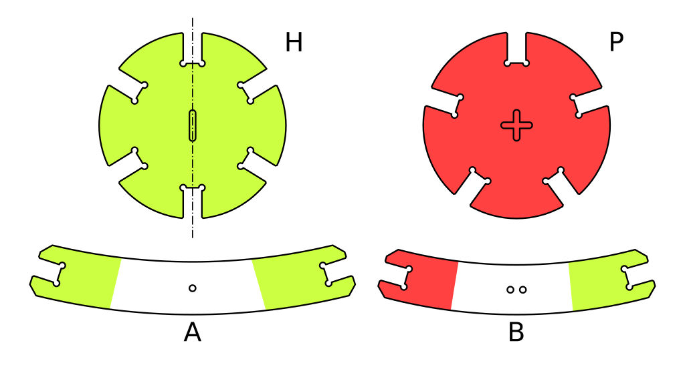
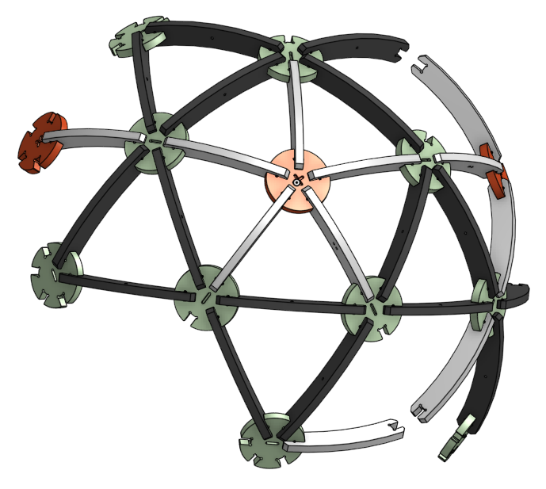
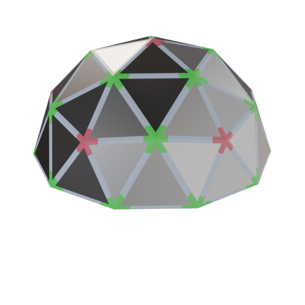
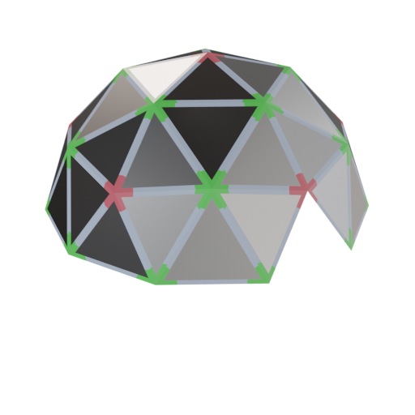
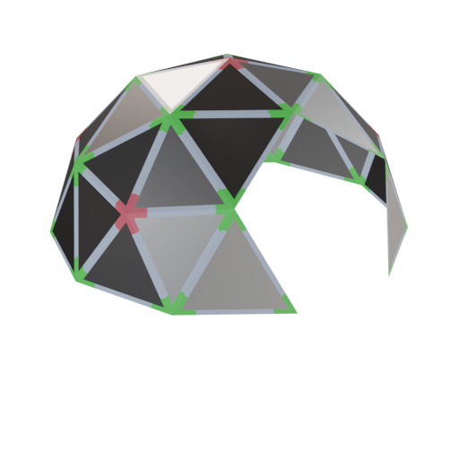

Icosphere geodesic dome & sphere
================================

This repo holds everything you need in order to laser cut a icosphere sphere.
It is pretty easy & fun to create nice bowls, lamp shades & other designs.
If you have a large enough laser cutter, these could also be used as tents.

Use this [SVG](dome.optimized.svg) to get started!!!

# Assembly

There are four different parts:
* An almost hexagonal joint (H)
* A perfect pentogonal joint (P)
* A long link (A)
* A short link (B)

The star of the show being H.
It lacks the six-way symmetry of the hexagon, but still has vertical symmetry (as denoted by the vertical mark).

Joint and link should be assembled by matching colors on each part.
By sure to connect B parts into H part along the symmetry mark.

There is only two kinds of triangle:
* HHH/AAA (equilateral)
* HPP/ABB (isocele)

# Part listings

By combining many of these basic parts, one can create more complex structures, like a sphere, a dome, a lamp shade, ...
Here are a few examples.

|            | Hex | Pen |   I |  II |
|:-----------|----:|----:|----:|----:|
|     Sphere |  12 |  30 |  60 |  60 |
|       Dome |   6 |  20 |  30 |  35 |
| Small door |   6 |  20 |  30 |  34 |
| Large door |   5 |  20 |  25 |  34 |

## Sphere

## Dome

## Small door

## Large door

