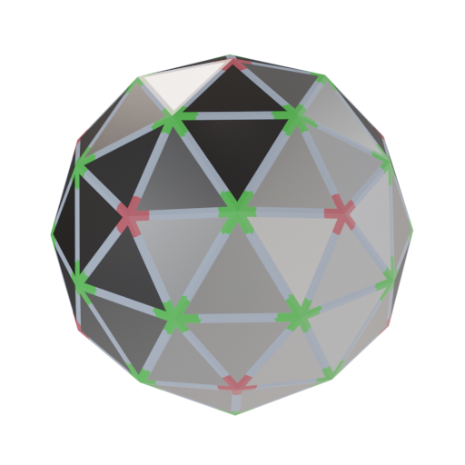

Icosphere sphere geodesic dome & sphere
=======================================

coucou

# Assembly

There are four different parts:
* An almost hexagonal joint (H)
* A perfect pentogonal joint (P)
* A long link (A)
* A short link (B)

The star of the show being H.
It lacks the six-way symmetry of the hexagon, but still has vertical symmetry (as denoted by the vertical mark).

Joint and link should be assembled by matching colors on each part.
By sure to connect B parts into H part along the symmetry mark.

# Part listings

By combining many of these basic parts, one can create more complex structures, like a sphere, a dome, a lamp shade, ...
Here are a few examples.

|            | Hex | Pen |   I |  II |
|:-----------|----:|----:|----:|----:|
|     Sphere |  12 |  30 |  60 |  60 |
|       Dome |   6 |  20 |  30 |  35 |
| Small door |   6 |  20 |  30 |  34 |
| Large door |   5 |  20 |  25 |  34 |

## Sphere

## Dome

## Small door

## Large door

